# Design System

Generated from `src/design/registry.ts`. Do not hand-edit layout, palette, or typography tables without updating the registry and rerunning `pnpm ytvf:design-docs`.

## Layout Templates

The factory ships 17 YouTube layouts. Each preview is a 16:9 wireframe rendered from the exact 1920x1080 frame geometry used by the HyperFrames compiler.

### title-full-presenter

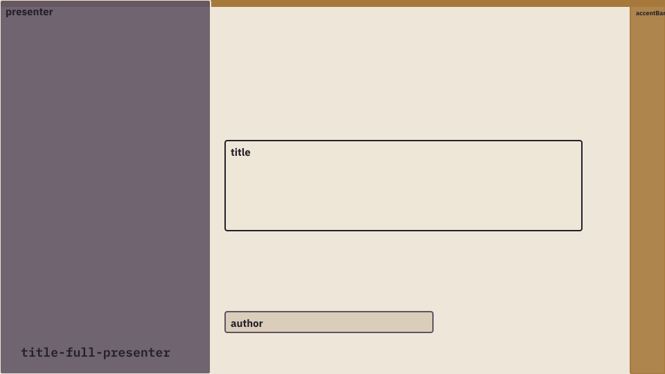

Primary opening title and full-presenter geometry.

| Frame | Origin | Size |
|---|---:|---:|
| presenter | 0, 0 | 608 x 1080 |
| accentBar | 1820, 0 | 100 x 1080 |
| title | 650, 405 | 1030 x 260 |
| author | 650, 900 | 600 x 60 |

### title-circle-presenter

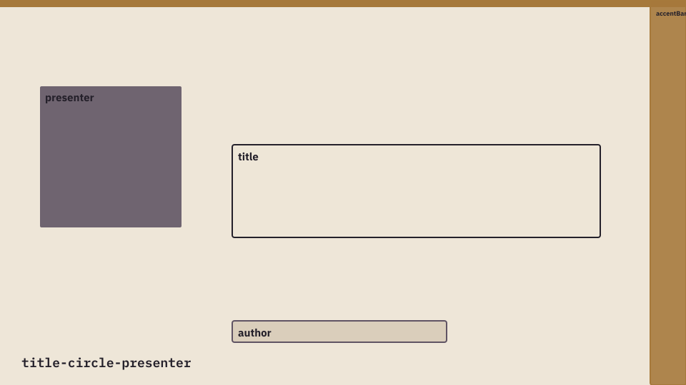

Opening title with a reduced presenter footprint.

| Frame | Origin | Size |
|---|---:|---:|
| presenter | 110, 240 | 400 x 400 |
| accentBar | 1820, 0 | 100 x 1080 |
| title | 650, 405 | 1030 x 260 |
| author | 650, 900 | 600 x 60 |

### feature-16x9-cinematic

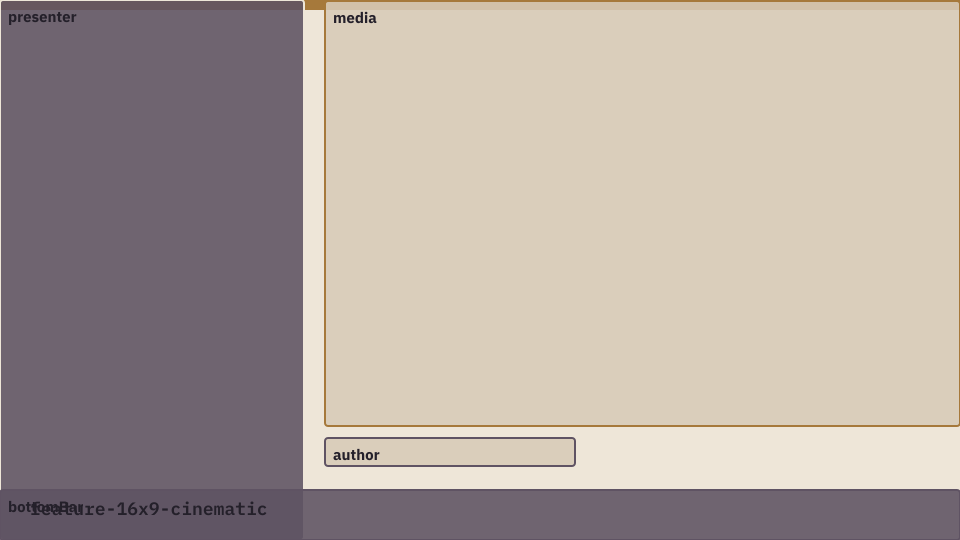

Presenter commentary beside cinematic footage.

| Frame | Origin | Size |
|---|---:|---:|
| presenter | 0, 0 | 608 x 1080 |
| media | 650, 1 | 1270 x 850 |
| author | 650, 875 | 500 x 55 |
| bottomBar | 0, 980 | 1920 x 100 |

### feature-16x9-product

Presenter beside uncropped software or product media.

| Frame | Origin | Size |
|---|---:|---:|
| presenter | 0, 0 | 608 x 1080 |
| media | 650, 1 | 1270 x 850 |
| author | 650, 875 | 500 x 55 |
| bottomBar | 0, 980 | 1920 x 100 |

### feature-4x3

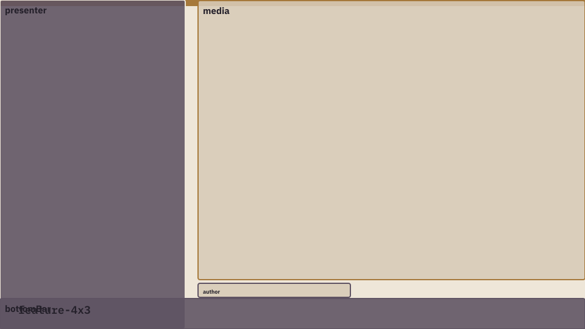

Presenter beside a 4:3 instructional feature.

| Frame | Origin | Size |
|---|---:|---:|
| presenter | 0, 0 | 608 x 1080 |
| media | 650, 1 | 1270 x 915 |
| author | 650, 930 | 500 x 45 |
| bottomBar | 0, 980 | 1920 x 100 |

### portrait-9x16-with-text

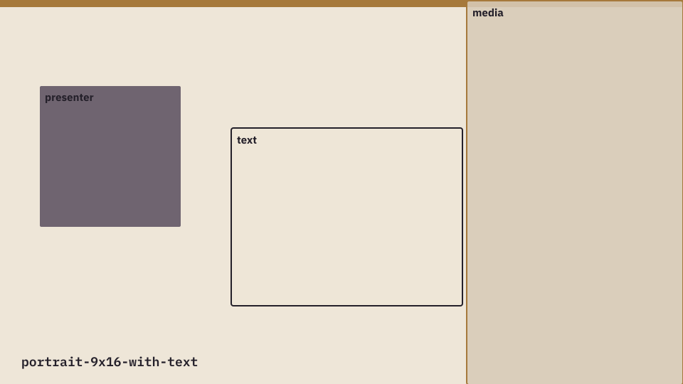

Commentary with portrait screen recording or mobile video.

| Frame | Origin | Size |
|---|---:|---:|
| presenter | 110, 240 | 400 x 400 |
| text | 650, 360 | 650 x 500 |
| media | 1312, 1 | 608 x 1079 |

### text-presenter-top-right

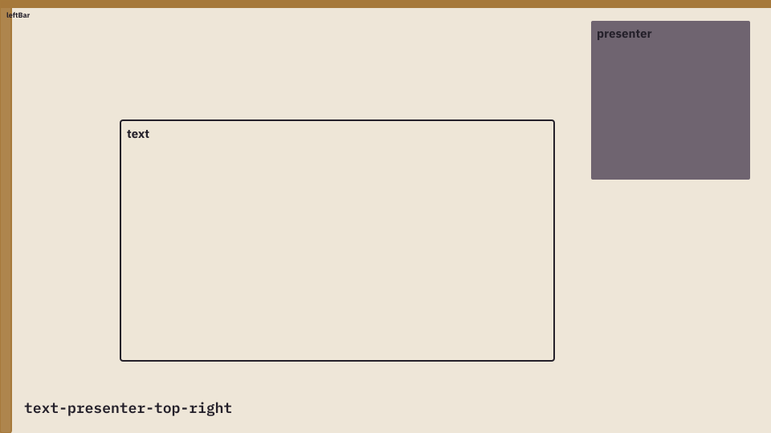

Text-led explanation with an upper-right presenter.

| Frame | Origin | Size |
|---|---:|---:|
| leftBar | 0, 0 | 27 x 1080 |
| text | 300, 300 | 1080 x 600 |
| presenter | 1470, 50 | 400 x 400 |

### text-presenter-bottom-right

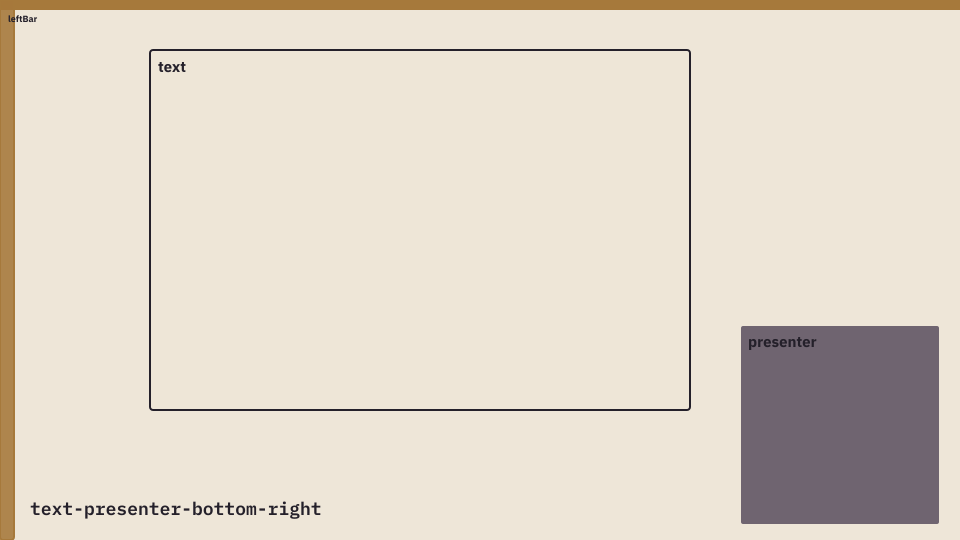

Text-led argument with a lower-right presenter.

| Frame | Origin | Size |
|---|---:|---:|
| leftBar | 0, 0 | 27 x 1080 |
| text | 300, 100 | 1080 x 720 |
| presenter | 1480, 650 | 400 x 400 |

### feature-left-4x3

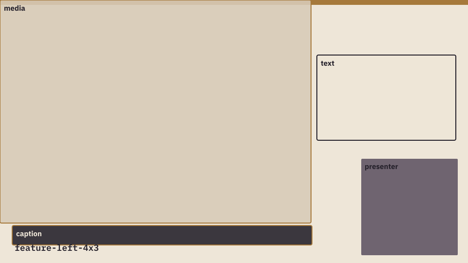

Large 4:3 media with right-side commentary.

| Frame | Origin | Size |
|---|---:|---:|
| media | 0, 0 | 1275 x 915 |
| caption | 50, 925 | 1230 x 80 |
| text | 1300, 225 | 570 x 350 |
| presenter | 1480, 650 | 400 x 400 |

### three-up-4x3

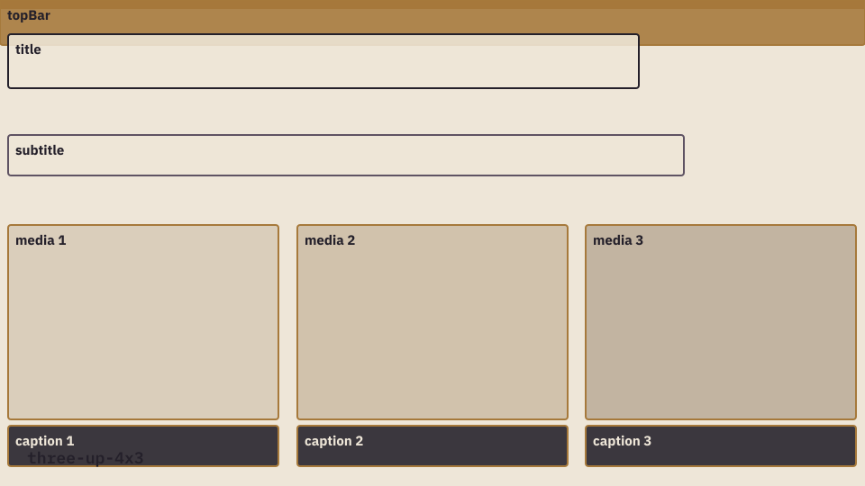

Three-way landscape comparison.

| Frame | Origin | Size |
|---|---:|---:|
| topBar | 0, 0 | 1920 x 100 |
| title | 17, 75 | 1400 x 120 |
| subtitle | 17, 300 | 1500 x 90 |
| media1 | 17, 500 | 600 x 431 |
| media2 | 659, 500 | 600 x 431 |
| media3 | 1300, 500 | 600 x 431 |
| caption1 | 17, 945 | 600 x 90 |
| caption2 | 659, 945 | 600 x 90 |
| caption3 | 1300, 945 | 600 x 90 |

### three-up-9x16

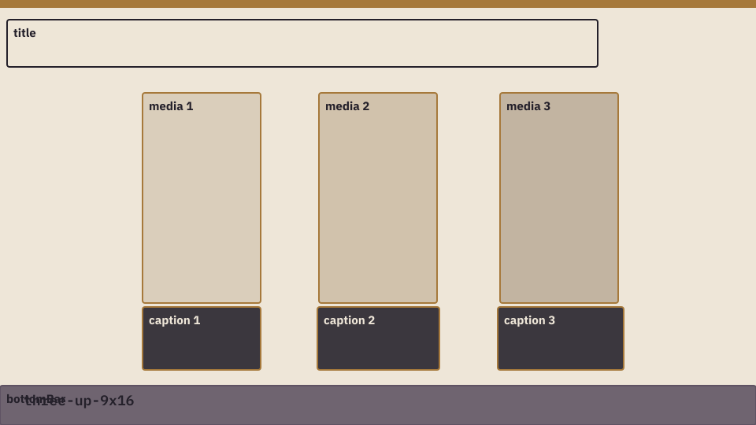

Three-way portrait or mobile comparison.

| Frame | Origin | Size |
|---|---:|---:|
| title | 17, 50 | 1500 x 120 |
| media1 | 362, 235 | 300 x 533 |
| media2 | 810, 235 | 300 x 533 |
| media3 | 1269, 235 | 300 x 533 |
| caption1 | 362, 780 | 300 x 160 |
| caption2 | 805, 780 | 310 x 160 |
| caption3 | 1263, 780 | 320 x 160 |
| bottomBar | 0, 980 | 1920 x 100 |

### feature-left-16x9

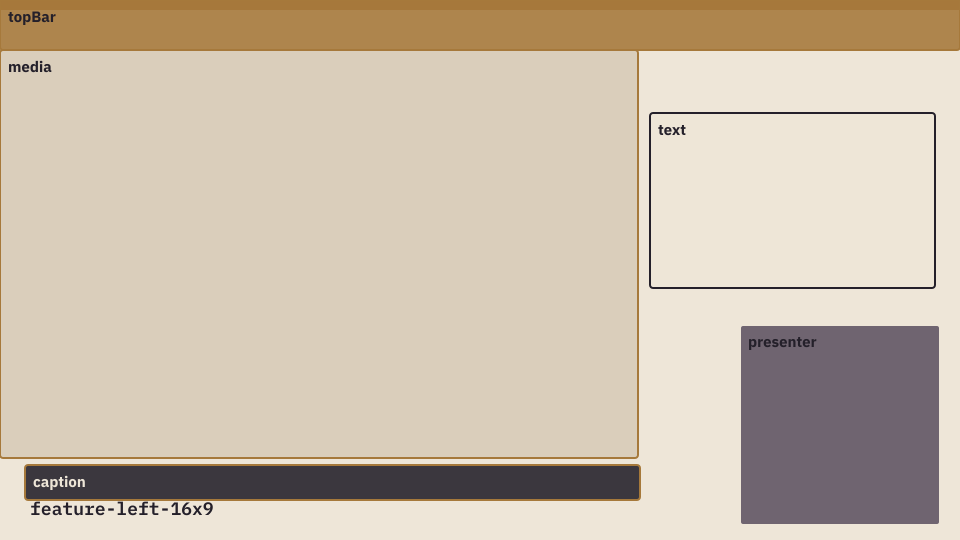

Cinematic left feature with right-side commentary.

| Frame | Origin | Size |
|---|---:|---:|
| topBar | 0, 0 | 1920 x 100 |
| media | 0, 100 | 1275 x 815 |
| caption | 50, 930 | 1230 x 70 |
| text | 1300, 225 | 570 x 350 |
| presenter | 1480, 650 | 400 x 400 |

### matrix-2x2

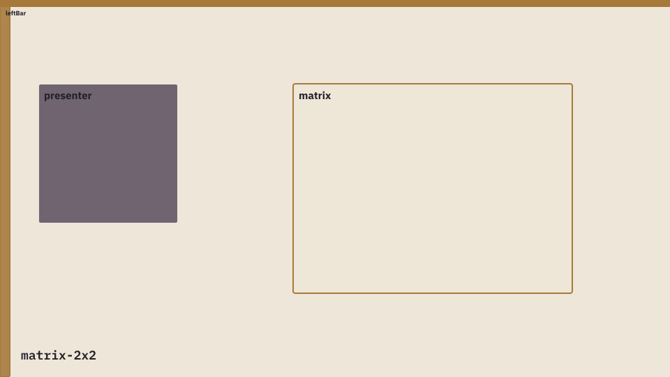

Presenter-led classification or strategy matrix.

| Frame | Origin | Size |
|---|---:|---:|
| leftBar | 0, 0 | 27 x 1080 |
| presenter | 110, 240 | 400 x 400 |
| matrix | 840, 240 | 800 x 600 |

### chart-cartesian

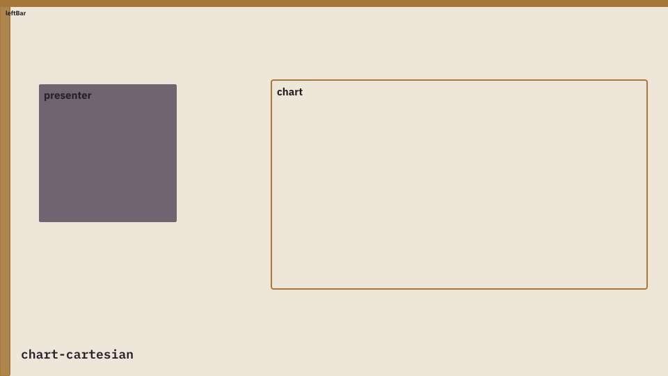

Presenter-led bar or line chart.

| Frame | Origin | Size |
|---|---:|---:|
| leftBar | 0, 0 | 27 x 1080 |
| presenter | 110, 240 | 400 x 400 |
| chart | 780, 230 | 1080 x 600 |

### chart-pie

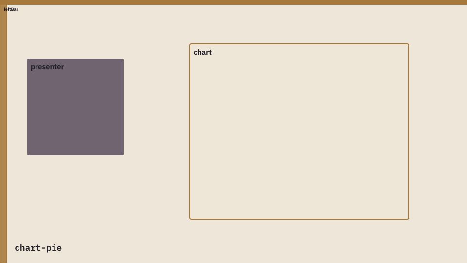

Presenter-led composition or share breakdown.

| Frame | Origin | Size |
|---|---:|---:|
| leftBar | 0, 0 | 27 x 1080 |
| presenter | 110, 240 | 400 x 400 |
| chart | 780, 180 | 900 x 720 |

### open-canvas

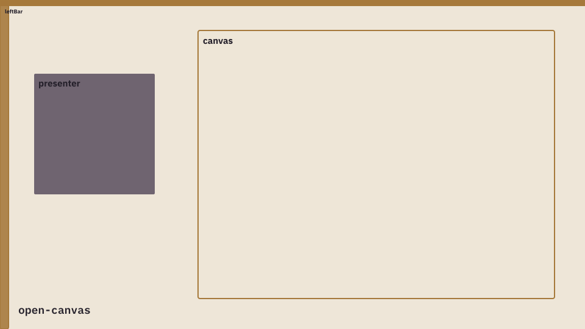

Bounded custom diagrams, equations, or generated visuals.

| Frame | Origin | Size |
|---|---:|---:|
| leftBar | 0, 0 | 27 x 1080 |
| presenter | 110, 240 | 400 x 400 |
| canvas | 650, 100 | 1170 x 880 |

### quote

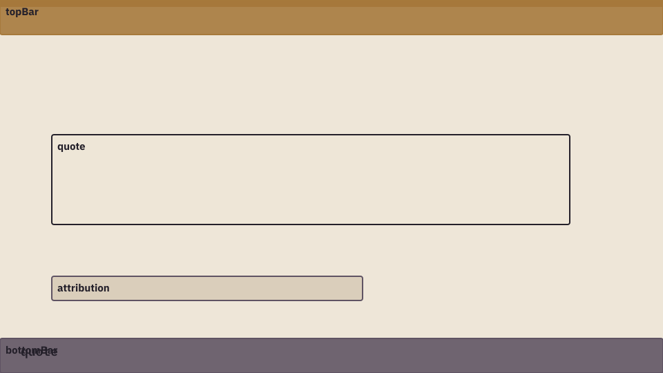

Quotation, thesis, source excerpt, or closing thought.

| Frame | Origin | Size |
|---|---:|---:|
| topBar | 0, 0 | 1920 x 100 |
| quote | 150, 390 | 1500 x 260 |
| attribution | 150, 800 | 900 x 70 |
| bottomBar | 0, 980 | 1920 x 100 |

## Palettes

The registry contains 31 original palettes plus 1 factory palette.

| ID | Name | Group | Swatches | Hex Values | Primary | Surface | Ink |
|---|---|---|---|---|---|---|---|
| `ucc-core` | UCC Core | channel |  | `#D94A55` `#101A2F` `#FFFBFB` `#E7B2BC` `#5A7690` | #D94A55 | #FCEFF0 | #101A2F |
| `math` | Math | channel |  | `#2D6CDF` `#101A2F` `#DFEAFF` `#AFC4D4` `#F2F5F6` | #2D6CDF | #DFEAFF | #101A2F |
| `science` | Science | channel |  | `#087F72` `#D89B32` `#D9F0EB` `#101A2F` `#F2F5F6` | #087F72 | #D9F0EB | #101A2F |
| `history` | History / Sociology | channel |  | `#8B3F35` `#24364B` `#EEE0D2` `#101A2F` `#F4F1EA` | #8B3F35 | #EEE0D2 | #101A2F |
| `ela` | ELA | channel |  | `#8A4568` `#D97855` `#F1DFE8` `#101A2F` `#FFFBFB` | #8A4568 | #F1DFE8 | #101A2F |
| `ai` | AI / Technology | channel |  | `#1F9BB7` `#6557B8` `#D9EEF5` `#101A2F` `#F2F5F6` | #1F9BB7 | #D9EEF5 | #101A2F |
| `product` | Product Tutorial | channel |  | `#316EA8` `#D94A55` `#DDE8F3` `#101A2F` `#F2F5F6` | #316EA8 | #DDE8F3 | #101A2F |
| `pedagogy` | Pedagogy / Parents | channel |  | `#6F7F5B` `#B8694F` `#E5EADB` `#101A2F` `#F4F1EA` | #6F7F5B | #E5EADB | #101A2F |
| `midnight-heritage` | Midnight Heritage | inspiration |  | `#020202` `#223A5A` `#A2282B` `#38613F` `#BFB194` | #A2282B | #BFB194 | #020202 |
| `forest-harbor` | Forest Harbor | inspiration |  | `#133228` `#326042` `#B2CCDB` `#C3CDCE` `#D2C1A3` | #326042 | #B2CCDB | #133228 |
| `blush-polo` | Blush Polo | inspiration |  | `#050505` `#374752` `#FCC5EC` `#E4E9EF` `#D8D4CB` | #FCC5EC | #E4E9EF | #050505 |
| `anchor-crimson` | Anchor Crimson | inspiration |  | `#191C1F` `#41444C` `#9A9EA7` `#174041` `#C61F46` | #C61F46 | #9A9EA7 | #191C1F |
| `moss-atelier` | Moss Atelier | inspiration |  | `#050702` `#2D2D22` `#37420C` `#8A8567` `#F1F0EB` | #37420C | #F1F0EB | #050702 |
| `old-money-sky` | Old Money Sky | inspiration |  | `#0E0F0E` `#581F0D` `#D6B488` `#F3F3F0` `#B8CBD2` | #581F0D | #D6B488 | #0E0F0E |
| `espresso-fog` | Espresso Fog | inspiration |  | `#645143` `#CEBFB3` `#E0E3E7` `#8C8C8D` `#302423` | #645143 | #CEBFB3 | #302423 |
| `hunter-rose` | Hunter Rose | inspiration |  | `#1F5132` `#C1898B` `#FFFFFF` `#552E23` `#0A0812` | #1F5132 | #FFFFFF | #0A0812 |
| `violet-taupe` | Violet Taupe | inspiration |  | `#95939B` `#CECECE` `#B5ACC1` `#E3C4AD` `#4A4541` | #B5ACC1 | #CECECE | #4A4541 |
| `ash-pink-electric` | Ash Pink Electric | inspiration |  | `#E2C2BD` `#B8C2C4` `#ECECEF` `#0083BB` `#232A30` | #0083BB | #ECECEF | #232A30 |
| `wine-steel` | Wine & Steel | inspiration |  | `#EBF0F5` `#AC262D` `#751F22` `#25627C` `#131712` | #AC262D | #EBF0F5 | #131712 |
| `denim-crimson` | Denim Crimson | inspiration |  | `#B8CED9` `#14192C` `#AB2728` `#9DA6A5` `#EBEBEB` | #AB2728 | #B8CED9 | #14192C |
| `cyan-chocolate` | Cyan Chocolate | inspiration |  | `#719C95` `#C0D1BF` `#AECDE9` `#B9966E` `#381708` | #719C95 | #AECDE9 | #381708 |
| `sport-bloom` | Sport Bloom | inspiration |  | `#038A61` `#E84579` `#F696C1` `#F5D6DB` `#BDC8C9` | #038A61 | #F5D6DB | #14382E |
| `soft-rose-street` | Soft Rose Street | inspiration |  | `#EAE1E5` `#E3D1BF` `#C4BDB8` `#EBC4B9` `#D48179` | #D48179 | #EAE1E5 | #3C3435 |
| `orchid-citrus` | Orchid Citrus | inspiration |  | `#F096C8` `#0392F0` `#85A441` `#FFC025` `#EF790B` | #F096C8 | #FFC025 | #25351A |
| `cavalli-coast` | Cavalli Coast | inspiration |  | `#D7511D` `#E4D4BA` `#9CBAB6` `#558BA3` `#193048` | #D7511D | #9CBAB6 | #193048 |
| `bordeaux-noir` | Bordeaux Noir | inspiration |  | `#191917` `#6D6864` `#FCD6BC` `#5B191D` `#2D1012` | #5B191D | #FCD6BC | #191917 |
| `kalamata-harbor` | Kalamata Harbor | inspiration |  | `#080808` `#62424D` `#545E3A` `#476482` `#E2E1DB` | #62424D | #545E3A | #080808 |
| `yacht-club` | Yacht Club | inspiration |  | `#28A476` `#A7C3B2` `#F5F5F5` `#0289CD` `#0244A6` | #28A476 | #A7C3B2 | #0244A6 |
| `peach-veil` | Peach Veil | inspiration |  | `#1C1813` `#AA9485` `#BF9F92` `#DCC9C3` `#E4E4E4` | #BF9F92 | #DCC9C3 | #1C1813 |
| `tiger-smoke` | Tiger Smoke | inspiration |  | `#E75323` `#F46B27` `#E7C7B9` `#C2C2C2` `#453F3D` | #E75323 | #E7C7B9 | #453F3D |
| `ivory-dusk` | Ivory Dusk | inspiration |  | `#182131` `#58586B` `#D8D4DE` `#DFD7CD` `#BEB6B0` | #58586B | #D8D4DE | #182131 |
| `ivory-dusk-editorial` | Ivory Dusk Editorial | factory |  | `#EEE6D8` `#D8CBB8` `#24202A` `#5F5363` `#A6793B` | #A6793B | #D8CBB8 | #24202A |

## Typography

The public typography system is IBM Plex complete:

- IBM Plex Sans for body text, captions, and modern headlines
- IBM Plex Serif for editorial headlines and long-form authority
- IBM Plex Mono for technical labels, scene IDs, code, and research-style layouts

Newsreader remains vendored as an optional legacy/editorial font for older compositions, but the five built-in typography systems below use the IBM Plex family.

| ID | Name | Description | Title | Body | Caption | Mono |
|---|---|---|---|---|---|---|
| `editorial-authority` | Editorial Authority | IBM Plex Serif headline · IBM Plex Sans body | IBM Plex Serif | IBM Plex Sans | IBM Plex Sans | IBM Plex Mono |
| `modern-clarity` | Modern Clarity | IBM Plex Sans headline · IBM Plex Serif body | IBM Plex Sans | IBM Plex Serif | IBM Plex Sans | IBM Plex Mono |
| `humanist-voice` | Humanist Voice | IBM Plex Sans headline · IBM Plex Serif body | IBM Plex Sans | IBM Plex Serif | IBM Plex Sans | IBM Plex Mono |
| `research-notebook` | Research Notebook | Mono headline · Sans body | IBM Plex Mono | IBM Plex Sans | IBM Plex Sans | IBM Plex Mono |
| `technical-signal` | Technical Signal | Mono headline · Mono body | IBM Plex Mono | IBM Plex Mono | IBM Plex Sans | IBM Plex Mono |

## Design Packs

| ID | Name | Palette | Typography | Default Layout | Motion |
|---|---|---|---|---|---|
| `ivory-dusk` | Ivory Dusk | ivory-dusk | modern-clarity | feature-left-16x9 | soft-continuity |
| `ivory-dusk-editorial` | Ivory Dusk Editorial | ivory-dusk-editorial | editorial-authority | feature-left-4x3 | editorial-restraint |

## Add A New Design

1. Create a project-local design pack JSON using `examples/design-pack.json`.
2. Keep every palette to exactly five colors.
3. Choose typography from IBM Plex Sans, IBM Plex Serif, and IBM Plex Mono unless a licensed project font is vendored with notices.
4. Run `pnpm ytvf design add <project> <design-pack.json>`.
5. Run `pnpm ytvf design preview <project>` for a local catalog.
6. Promote reusable design packs only after recording provenance, intended use, and preview evidence.
